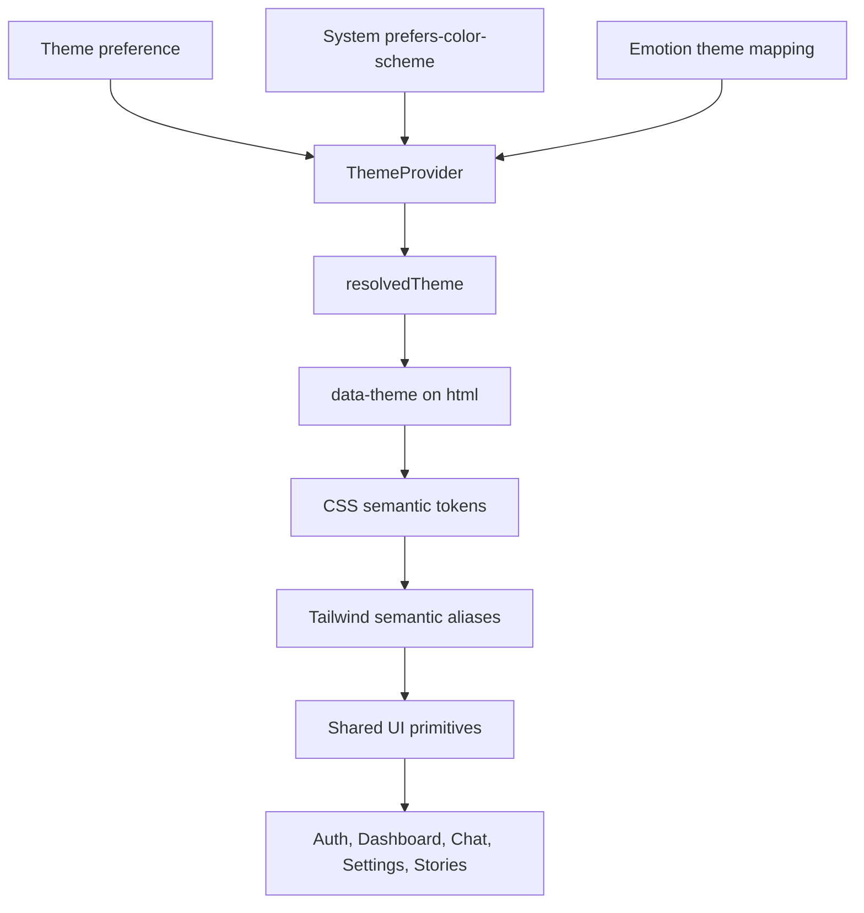

# Emotune Design System Migration

## Outcome

The frontend now uses a semantic, token-driven glass design system without changing backend APIs or chat business logic. Component gradients were removed; the only remaining gradients are the subtle application-background definitions in `client/src/index.css`.

## Architecture

The runtime theme path is:

`localStorage / system preference → public/theme-init.js → ThemeProvider → data-theme → CSS variables → Tailwind aliases → components`.

## Theme catalog

Defined in `client/src/theme/tokens/index.js`:

| Theme | Mode | Purpose |
|---|---|---|
| `system` | system | Follows the operating-system preference |
| `glass-white` | light | Luminous editorial light mode |
| `glass-sand` | light | Warm premium light mode |
| `glass-black` | dark | Focused neutral dark mode |
| `glass-midnight` | dark | Deep blue-black mode |
| `glass-ocean` | dark | Cool cyan-accent mode |
| `glass-emerald` | dark | Restrained green-accent mode |
| `glass-lavender` | dark | Refined violet-accent mode |

Legacy theme IDs remain backward compatible through aliases in the same token file.

## Semantic tokens

`client/src/index.css` defines RGB-channel tokens so Tailwind opacity modifiers work consistently.

Core tokens include:

`background`, `surface`, `surface-elevated`, `surface-floating`, `border`, `border-muted`, `primary`, `primary-hover`, `primary-active`, `on-primary`, `secondary`, `success`, `warning`, `danger`, `text-primary`, `text-secondary`, `text-muted`, `placeholder`, `online`, `offline`, `ai`, `ghost`, `memory`, `bookmark`, `selection`, `hover`, `focus`, and `disabled`.

Legacy `--theme-*` variables remain as compatibility aliases while feature code continues to migrate.

## Glass depth

Shared glass utilities are defined in `client/src/index.css`:

- `.glass-surface`: base translucent surface and glass shadow
- `.glass-elevated`: elevated surface for cards and panels
- `.glass-floating`: floating surface for high-priority UI
- `.glass-dialog`: dialog surface with stronger blur and elevation
- `.glass-popover`: menus, tooltips, reaction pickers, and contextual surfaces
- `.glass-input`: translucent input with semantic focus treatment

The background is the only gradient layer. Component surfaces use solid token colors with transparency and `backdrop-filter`.

## Tailwind architecture

`client/tailwind.config.js` now exposes semantic color aliases backed by CSS variables, semantic radius and shadow aliases, glass blur aliases, typography sizes, and restrained motion tokens. The theme does not contain product-specific hardcoded palette names.

`client/src/theme/variants/index.js` centralizes button and glass variants. `client/src/theme/utilities/index.js` provides the shared `cn()` helper using `tailwind-merge`.

## Shared component migration

The following primitives were migrated to semantic tokens and glass surfaces:

`Button`, `Card`, `GlassCard`, `Surface`, `Panel`, `Avatar`, `StatusDot`, `Badge`, `Chip`, `AIChip`, `IconButton`, `ActionButton`, `SearchInput`, `Input`, `Select`, `Toggle`, `Modal`, `Sheet`, `Menu`, `Dropdown`, `Tooltip`, `ListItem`, `TabBar`, `Slider`, `TextLogo`, and `Toaster`.

Scale, bounce, rotation, and hover-translation motion were removed from shared and feature UI. Remaining motion is limited to small opacity/pulse states and functional focus/position behavior.

## Feature surfaces migrated

The token migration covers the main application surfaces and feature modules under:

- `client/src/components/Sidebar`
- `client/src/components/Navbar`
- `client/src/components/ChatScreen`
- `client/src/components/MessageBubble`
- `client/src/components/MessageInput`
- `client/src/components/Stories`
- `client/src/components/Settings`
- `client/src/components/Landing`
- `client/src/components/auth`
- `client/src/components/ui`
- `client/src/pages`

Backend files were not modified.

## Responsive and accessibility behavior

- Desktop sidebar remains tokenized at the existing layout width.
- Tablet layout continues using the existing 320px sidebar token.
- Mobile panels retain their existing drawer behavior.
- Focus-visible states use the semantic focus token.
- High-contrast mode increases border and surface opacity.
- Reduced-motion preferences disable animation and transition timing.
- Dialog focus trapping and Escape behavior remain supported by the shared modal primitives.

## Measured migration result

Measured from the frontend source after migration:

| Metric | Result |
|---|---:|
| Source JS/JSX/CSS files | 185 |
| `className` sites | 2,166 |
| Inline-style sites | 59 |
| Remaining hex literals | 31 |
| Semantic Tailwind class uses | 1,778 |
| Glass utility uses | 245 |
| Component gradients | 0 |
| Scale/rotate/bounce/ping legacy motion matches | 0 |
| Owned CSS non-empty lines | 402 |

Compared with the earlier audit baseline, inline styles dropped from approximately 128 to 59 and hardcoded hex usage dropped from approximately 885 to 31. The remaining literals are isolated content colors, OAuth brand artwork, story-author content palettes, metadata, or external-brand data rather than application surface styling.

Approximate styling mix after migration:

- Tailwind utilities and semantic aliases: ~93%
- Custom CSS in `client/src/index.css`: ~7%
- CSS Modules: 0%
- Styled Components/Emotion: 0%

The remaining inline styles are primarily dynamic values such as progress widths, user-selected persona/story colors, media dimensions, and chart values.

## Screenshots

Desktop and mobile rendered QA screenshots are stored in `docs/screenshots/`.

## Validation

`npm.cmd run build` passes successfully. The browser QA pass verified:

- Desktop login rendering
- Mobile login rendering at 390px width
- No horizontal overflow
- Theme hydration to `glass-black`
- Visible glass surfaces
- No component background gradients
- No browser console errors during the tested reload flow

The only console messages observed were React Router v7 future-flag warnings.

## Scores

| Area | Before | After |
|---|---:|---:|
| Theme architecture | 5.0 | 9.2 |
| Design system | 4.5 | 9.0 |
| Tailwind architecture | 6.0 | 9.1 |
| CSS architecture | 6.0 | 8.8 |
| Maintainability | 5.5 | 8.8 |
| Production readiness | 6.0 | 8.7 |

These scores reflect the frontend styling migration only. They are not a claim that backend security, infrastructure, or product completeness is 10/10.

## Notes

`client/scripts/migrate-design-tokens.mjs` documents the repeatable mechanical token and gradient migration used during this phase. It should be treated as a migration utility, not as a runtime dependency.

## Centralization follow-up

The follow-up pass added explicit semantic aliases for muted/glass surfaces, strong/glass/focus/error/success borders, info, typing, mention, notification, surface content, component control heights, z-index layers, blur levels, opacity levels, typography roles, and named motion durations in `client/tailwind.config.js`. Theme-specific values for those tokens are defined in `client/src/index.css`; components consume the Tailwind aliases or existing compatibility aliases during incremental migration.

Dynamic user/content colors remain data-driven where the product intentionally allows user-selected persona, story, avatar, or OAuth brand colors. They are not used as the application palette and have semantic fallbacks.

## Landing background system

The landing page now uses section-specific reusable Tailwind background utilities backed by theme variables:

| Utility | Usage |
|---|---|
| `bg-landing-page` | Page base |
| `bg-landing-hero` | Hero and navigation field |
| `bg-landing-features` | Statistics, features, and FAQ |
| `bg-landing-ai` | Product / AI showcase |
| `bg-landing-how` | How-it-works timeline |
| `bg-landing-light` | Why-choose-us and testimonials |
| `bg-landing-cta` | Conversion section |
| `bg-landing-footer` | Dark luxury footer |

These backgrounds use CSS gradients only as large section-level ambient lighting. Buttons, cards, chat rows, message bubbles, icons, and inputs remain solid or glass surfaces. The AI and footer sections scope dark semantic surface/text channels locally so they remain readable in light themes without changing component markup or business logic.

The hero and CTA utilities also include responsive curved ribbon layers using pseudo-elements. These are deliberately CSS-only, low-opacity, and repositioned on mobile so the flowing light remains visible without creating horizontal overflow.

The hero now uses a scoped dark navy semantic surface with stronger royal-blue and violet ambient gradients, while the remaining landing sections continue using their own light/dark compositions.

## Global application background

`client/src/components/layout/ApplicationBackground.jsx` is the single shell-level canvas wrapped around `AppRouter` in `client/src/App.jsx`. It uses the theme-controlled `--app-background` and static ambient gradients. Full-page route roots are transparent so the canvas is visible across authentication, dashboard, memory, OAuth, and chat screens. The background layer intentionally has no `backdrop-filter`; blur is limited to glass surfaces such as cards, sidebars, panels, and dialogs.
